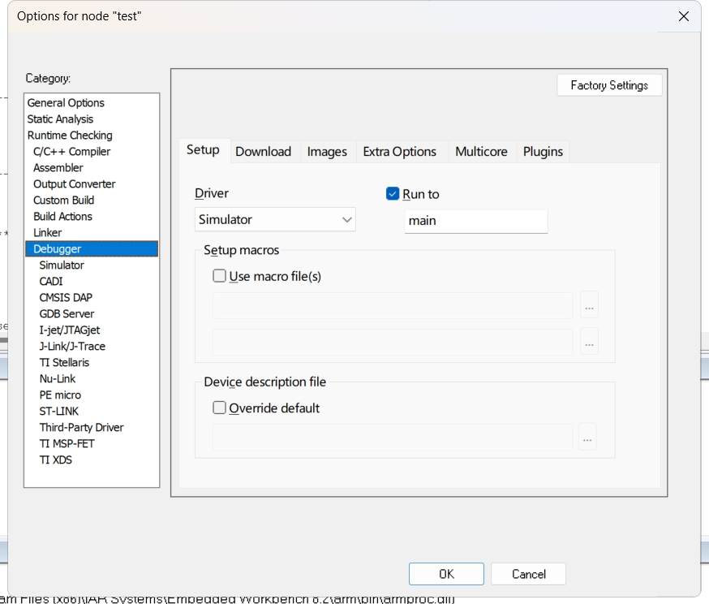
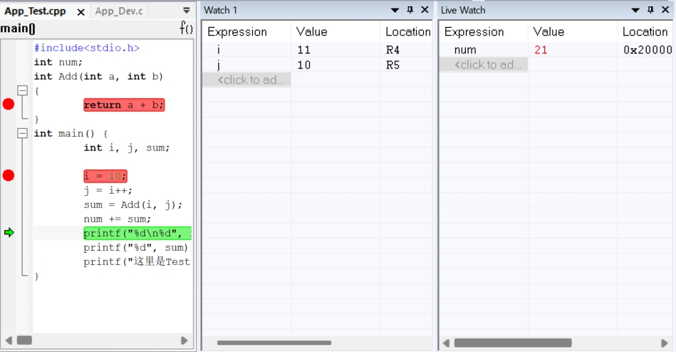

# IAR

IAR是一套用于**编译和调试嵌入式系统应用程序开发工具**，支持汇编、C和C++语言，为伙伴们提供了完整的集成开发环境，而且还包括管理器、编辑器等。同时IAR能够支持由不同芯片制造商生成，并且种类繁多。

## 一、工程操作

### 1. 各类型文件含义

* **eww 文件**：**工作空间文件**，用于管理多个工程的索引，打开 IAR 工程时需要此文件。
* **ewp 文件**：**工程文件**，包含编译器设置、链接器脚本、源文件列表等，是工程的核心配置文件。
* **ewd 文件**：**调试器配置文件**，用于保存调试相关的设置。
* **map 文件**：**内存映射文件**，用于分析代码的内存占用情况。
* **hex 文件**：**Intel 格式的固件文件**，常用于烧录到目标硬件。
* **bin 文件**：**二进制格式的固件文件**，与 hex 文件类似，但更适合某些特定场景。

### 2. 新建/打开工作区

点击菜单**File**——>**new Workspace**——>**save WorkSpace as**

* **新建工作区**
  
  
* **保存工作区**
  
  
  
  

### 3. 新建/打开工程

* 在**工作空间**选择**Project**——>**create new project**——>选择**Empty project。**

* 依次选择**File**和**Save Workspace**，再次保存工作空间。

  

### 4. 工作区中导入/添加工程

* 在IAR新建工作空间，**File → New → Workspace**
* 加入现有工程，**Project → Add Existing → Project**
* 打开IAR工程文件（**.EWP文件**），完成现有工程的添加

### 5. 新建分组

* 对已有的工程右击选择**Add**——>**Add Group**

  

### 6. 新建/打开文件

* **新建：**选择菜单**File**——>**new File**——>**save File as**——>分组右击选择**Add**——>**Add File**
* **打开：**对已有的分组右击选择**Add**——>**Add File**
* 

### 7. 工程目录与文件目录的关系

* **工程目录**是 IAR 工程文件（.ewp、.eww）所在的根目录，通常包含工程配置、编译输出文件等。
* **文件目录**是实际存储源代码（.c、.h）、库文件（.a、.lib）或其他资源的目录。

工程目录作为整个项目的核心管理单元，包含了关键的工程配置文件和管理编译输出的生成位置，而文件目录则是实际存储各类开发资源的物理位置，包括源代码文件、头文件、库文件等，这些目录既可以作为子目录嵌套在工程目录内部，也可以完全独立地位于工程目录之外的其他路径，两个目录之间的关联是通过路径引用来实现的。

## 二、工程配置

### **设备配置**

1. 修改芯片型号，选择主菜单 **Project > Options**，在打开的 Options 窗口左边的 **Category** 中选择 **General Options**，然后在右边的**Device**旁边按钮点击，选型自己的芯片型号。
2. 修改预处理定义符及头路径，在 Options 窗口的 Category 中选择 C/C++ Compiler，Preprocessor 页面中,根据芯片的闪存存储器容量修改定义符一般有（STM32F10X_HD、STM32F10X_MD、STM32F10X_LD）。
3. j-link配置，在 Options 窗口的 Category 中选择Debug下面的J-Link/J-Trace，Connction 页面中,进行模式修改。

### **编译配置**

* 优化等级：**None、Low、Medium、High**
  * None、Low只会做无用代码、冗余标签、冗余分支消除等优化，适合调试；
  * Medium主要优化代码逻辑、公共子表达式消除等
  * High则几乎勾选了所有优化项，**向量化仅在 High -> Speed有效**

### 硬件浮点

利用微控制器（MCU）内置的浮点运算单元（FPU，Floating-Point Unit） 来加速浮点数计算。

### 预处理

**C/C++ Compiler**

* | 配置项                      | 作用                             |
  | --------------------------- | -------------------------------- |
  | **Defined symbols**         | 定义全局宏（`#define`）          |
  | **Additional include dirs** | 添加头文件搜索路径（`#include`） |
  | **Preprocess output**       | 生成预处理后的代码（`.i` 文件）  |

* 链接文件：定义可用的可编址空间（memory）、ROM或RAM的可用内存区域（region）、Block 定义应用程序初始化、放置section、使用symbols, expressions, and numbers。
* 文件路径配置
* 输出文件路径
* 输出文件配置

### 调试器配置

**右键工程名** → **Options** → **Debugger**

* 库相关配置

### 静态库的封装

- ~~~
  封装源代码，对外不开放，提高保密性。
  将标准功能函数封装成库，提高代码的复用性。
  使用库开发，简化开发流程，提高开发效率。
  系统调用库函数，提高执行效率。
  ~~~

- 修改编译输出方式选择为**Output---->Library,**也就是输出为**创建lib库**，并在**Library Builder**选择库保存路径并输入库的名称**.lib**。

  - 
  - 

- **Rebuild All**

  - 
  - 

### 静态库的调用

- 将系统编译输出选项更改为**可执行文件**
  - 
- 将lib文件添加到系统工程中
  - 
- 重新编译工程(**Rebuild All**)

## 工程调试

### 断点

· 设置断点：点击代码行左侧
· 禁用断点：右击选择disable breakpoint
· 启用断点：右击选择enable breakpoint
· 删除断点：再次点击
· 条件断点：右击断点处选择Eit breakpoint——> 填写expression

### 监控信息

**对要查看的变量右击选择Add to Watch/Live Watch**

- **watch**可以查看全部变量的值和地址信息
- **Live watch**只能查看全局变量的值和信息

### 寄存器信息

**view——>Registers**

- 

### 内存信息

**view——>Memory**

- 

### 栈信息

**view——>Stack**

- 

### 汇编信息

- 

### 调用堆栈信息

### 单步调试

| 指令              | 效果                                                         |
| ----------------- | ------------------------------------------------------------ |
| 单步执行Step Over | 单步执行一条C语句或汇编指令，不跟踪进入C函数或者汇编语言子程序 |
| 单步执行Step Into | 跟踪执行一条C语句或汇编指令，跟踪进入C函数或者汇编语言子程序 |
| Step Out:         | 启动C函数或汇编语言子程序从当前位置开始执行，并返回到调用该函数或子程序的下一语句 |
| Next Statement    | 直接运行到下一条语句                                         |
| Run to Cursor     | 从当前位置运行到光标指定处                                   |
| Break             | 终止运行                                                     |
| Reset             | 复位                                                         |
| Stop Debugging    | 退出调试器                                                   |

