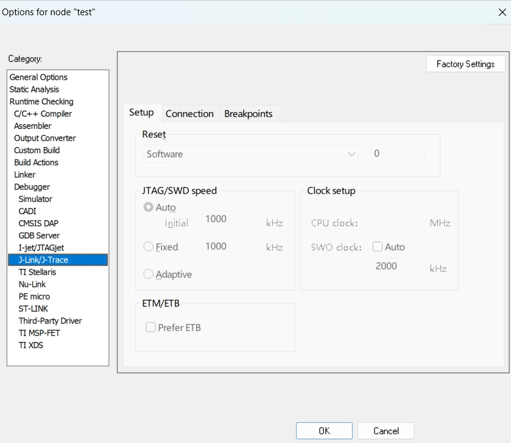

# IAR

IAR是一套用于**编译和调试嵌入式系统应用程序开发工具**，支持汇编、C和C++语言，为伙伴们提供了完整的集成开发环境，而且还包括管理器、编辑器等。同时IAR能够支持由不同芯片制造商生成，并且种类繁多。

## 一、工程操作

### 1. 各类型文件含义

* **eww 文件**：**工作空间文件**，用于管理多个工程的索引，打开 IAR 工程时需要此文件。
* **ewp 文件**：**工程文件**，包含编译器设置、链接器脚本、源文件列表等，是工程的核心配置文件。
* **ewd 文件**：**调试器配置文件**，用于保存调试相关的设置。
* **map 文件**：**内存映射文件**，用于分析代码的内存占用情况。
* **hex 文件**：**Intel 格式的固件文件**，常用于烧录到目标硬件。
* **bin 文件**：**二进制格式的固件文件**，与 hex 文件类似，但更适合某些特定场景。

**工具栏的简单介绍**

1. 
2. 

### 2. 新建/打开工作区

**步骤**：点击菜单**File**——>选择**new Workspace**——>选择**save WorkSpace as**

* **新建工作区**
  
  
* **保存工作区**
  
  
  
  

### 3. 新建/打开工程

**步骤：**

* 在**工作空间**选择**Project**——>**create new project**——>选择**Empty project。**

* 依次选择**File**和**Save Workspace**，再次保存工作空间。

  

### 4. 工作区中导入/添加工程

* 在IAR新建工作空间，**File → New → Workspace**
* 加入现有工程，**Project → Add Existing → Project**
* 打开IAR工程文件（**.EWP文件**），完成现有工程的添加

### 5. 新建分组

* 对已有的工程右击选择**Add**——>**Add Group**

  

### 6. 新建/打开文件

* **新建：**选择菜单**File**——>**new File**——>**save File as**——>分组右击选择**Add**——>**Add File**
* **打开：**对已有的分组右击选择**Add**——>**Add File**
* 

### 7. 工程目录与文件目录的关系

* **工程目录**是 IAR 工程文件（.ewp、.eww）所在的根目录，通常包含工程配置、编译输出文件等。
* **文件目录**是实际存储源代码（.c、.h）、库文件（.a、.lib）或其他资源的目录。

工程目录作为整个项目的核心管理单元，包含了关键的工程配置文件和管理编译输出的生成位置，而文件目录则是实际存储各类开发资源的物理位置，包括源代码文件、头文件、库文件等，这些目录既可以作为子目录嵌套在工程目录内部，也可以完全独立地位于工程目录之外的其他路径，两个目录之间的关联是通过路径引用来实现的。

## 二、工程配置

### **设备配置**

#### **修改芯片型号**

选择主菜单 **Project > Options**，在打开的 Options 窗口左边的 **Category** 中选择 **General Options**，然后在右边的**Device**旁边按钮点击，选型自己的芯片型号。

#### **j-link配置**

在 **Options** 窗口的 **Category** 中选择**Debug**下面的**J-Link/J-Trace**，**Connction** 页面中,进行模式修改。

 	1.  **Connection（连接方式）**
 	  	1.  **USB**：USB线连接调试器（如J-Link、ST-LINK）
 	  	2.  **TCP/IP**：网络连接远程调试器（需填写IP地址）
 	  	3.  **Interface（通信接口）**
 	       	1.  JTAG：标准JTAG接口（需4-5根线，支持多设备链式连接）。
 	       	2.  SWD：Serial Wire Debug（2根线：SWDIO + SWCLK），ARM芯片常用，占用引脚少。
 	       	3.  CJTAG：压缩JTAG（较少使用）。
 	  	4.  **JTAG scan chain**：当通过JTAG连接多个设备时，需配置扫描链（TAP数量、设备类型）
 	2.  **Setup（设置）**
 	  	1.  **Reset（复位方式）**
 	       	1.  **Software（软件复位）**：通过调试协议发送软件复位命令（不触发硬件复位信号）。
 	       	2.  **Hardware（硬件复位）**：通过调试器的硬件复位线（如NRST引脚）复位芯片。
 	  	2.  **JTAG/SWD speed（调试接口速度）**
 	       	1.  **Auto（自动）**
 	       	2.   **Fixed（固定速率）**
 	       	3.  **Adaptive（自适应）**：根据目标芯片状态动态调整速率（如芯片睡眠时自动降速）。
 	  	3.  **Clock setup（时钟设置）**：
 	       	1.  **CPU clock（CPU时钟）**：告知调试器目标芯片的实际主频
 	       	2.  **SwO clock（SWO时钟）**：设置SWO（Serial Wire Output）引脚的数据输出速率
 	  	4.   **ETM/ETB（嵌入式跟踪）**

### **编译配置**

#### 优化等级

**None、Low、Medium、High**

* None、Low只会做无用代码、冗余标签、冗余分支消除等优化，适合调试；

* Medium主要优化代码逻辑、公共子表达式消除等

* High则几乎勾选了所有优化项，**向量化仅在 High -> Speed有效**

#### 硬件浮点

利用微控制器（MCU）内置的浮点运算单元（FPU，Floating-Point Unit） 来加速浮点数计算。

**配置步骤：**在 **Options** 窗口的 **Category** 中选择**Genera Options**，然后选择**芯片**后设置**Target**中的**FPU**（灰色表示当前芯片不支持浮点加速）。

#### 预处理

**C/C++ Compiler**

##### 1. **头文件路径宏定义配置**

在 **Options** 窗口的 **Category** 中选择 **C/C++ Compiler**，**Preprocessor** 页面中,根据芯片的闪存存储器容量修改定义符一般有（STM32F10X_HD、STM32F10X_MD、STM32F10X_LD）。

* **Ignore standard include directories**：忽略IAR编译器自带的 **标准头文件搜索路径**（如C标准库头文件 `stdio.h`、`stdlib.h` 等）。
* **Additional include directories** ：指定 **额外的头文件搜索路径**，编译器会在此处查找 `#include "file.h"` 或 `#include <file.h>` 中的文件。
* **Preinclude file**：强制在编译所有源文件之前，**隐式包含一个指定的头文件**（相当于在所有文件开头添加 `#include "file.h"`）。
* **Defined symbols**：全局定义预处理器宏（无需在代码中写 `#define`），也就是**宏定义**部分。

| 配置项                      | 作用                             |
| --------------------------- | -------------------------------- |
| **Defined symbols**         | 定义全局宏（`#define`）          |
| **Additional include dirs** | 添加头文件搜索路径（`#include`） |
| **Preprocess output**       | 生成预处理后的代码（`.i` 文件）  |

##### 2. 链接文件

定义可用的可编址空间（memory）、ROM或RAM的可用内存区域（region）、Block 定义应用程序初始化、放置section、使用symbols, expressions, and numbers。

**向量表和堆栈设置**

在 **Options** 窗口的 **Category** 中选择 **Linker**设置

**Stack/Heap Sizes（堆栈大小配置）**

				1. **CSTACK（主栈空间）**：用于存储局部变量、函数调用时的返回地址等。
				1. **HEAP（堆空间）**：动态内存分配（如 `malloc`、`free`）使用的区域。
				1. **PROC STACK（进程栈，可选）**：在多任务系统（如RTOS）中，为每个任务分配独立栈空间。
				1. **Vector Table（中断向量表）**：存储中断服务函数（ISR）的入口地址，芯片上电后首先读取此表。
				1.  **Memory Regions（内存区域定义）**

##### 4. 输出文件格式配置

1. **Output format**：输出格式
   1. hex：Intel HEX的扩展版本，支持32位地址（普通Hex仅16位）。
   2. records：ASCII文本格式，每行以 `S` 开头，包含地址、数据和校验和。
   3. TXT：TI定义的文本格式，类似Hex但语法不同。
   4. bin：纯二进制数据流，无地址信息。
   5. code：IAR专用简化格式，介于Hex和Bin之间。
2. **Output file > Override default**：自定义生成的附加输出文件的名称和路径，而非使用IAR默认生成的名称。

##### 3. 输出文件路径

1. **Output file（输出类型）**
   1. Exectable（可执行文件）：生成可烧录到芯片的 **可执行文件**（默认格式为 `.out`，ELF格式，含调试信息）。
   2. Library（库文件）：将工程编译为 **静态库文件**（`.a` 或 `.lib`），供其他项目调用。
2. **Output directories（输出路径）**
   1. **Executables/libraries（可执行文件/库文件路径）**
   2. **Object files（目标文件路径）**
   3.  **List files（列表文件路径）**：存放编译器/汇编器生成的 **列表文件**（`.lst`），包含源码与机器码的映射关系。

### 调试器配置

**右键工程名** → **Options** → **Debugger**

1. **Driver（调试驱动选择）**：选择与硬件调试器匹配的驱动协议，（**Simulator（软件仿真模式）**）。

2. **Run to（运行到指定位置）**：调试入口，调试启动后自动运行到指定代码位置，跳过初始化过程。

3.  **Setup macros（调试宏配置）**：在调试会话中预加载宏定义，动态控制调试行为。

   ​	**Use macro file(s)**：指定宏文件（`.mac`），每行一个宏命令。

4.  **Device description file（设备描述文件）**:覆盖IAR默认的芯片描述文件（`.ddf`），自定义Flash编程算法或内存布局。

### **库相关配置**

1. **Library**:选择是否链接标准运行时库（如`DLib`）。

   1. None：不链接任何标准库，需手动实现所有底层函数（如printf、malloc）。
   2. Semihosted：通过调试器实现IO（如输出printf到调试终端）。
   3. Full：完整标准库支持（默认）。

2. **Configuration file**：指定自定义的库配置文件（如`.xcl`），覆盖默认库行为。

3. **Enable thread support in library**:启用库对多线程（如RTOS任务）的支持。

4. ### **Library low-level interface implementation**

   1. **None**：需手动实现所有底层函数
   2. **Semihosted**：通过调试器（如J-Link）实现IO（如打印日志到调试终端）。
   3. **Via SWO**：通过芯片的SWO引脚输出调试信息（需连接SWO线）。

5. **stdout/stderr**：指定标准输出/错误流的重定向方式。

6. **CMSIS配置**

7. Library Options（库选项）中
   1. Printf formatter、Scanf formatter 和 Buffered terminal output 是与格式化输入/输出（如printf、scanf）及终端输出行为相关的配置选项。

  2. **Heap Selection（堆内存分配策略）**：

     | Automatic         | 编译器自动选择默认堆实现（通常为`Basic heap`）。         |
     | ----------------- | -------------------------------------------------------- |
     | **Advanced heap** | 使用复杂堆管理（支持碎片整理），适合频繁动态分配的场景。 |
     | **Basic heap**    | 简单堆实现（无碎片优化），代码体积小。                   |
     | **No-free heap**  | 仅支持`malloc`，禁用`free`（一次性分配，永不释放）。     |

  3. **Locale Support（本地化支持）**：Use in addition to the C locale	扩展本地化支持（如中文、德文字符集，日期/数字格式）。

### 静态库的封装

封装源代码，对外不开放，提高保密性；将标准功能函数封装成库，提高代码的复用性；使用库开发，简化开发流程，提高开发效率；系统调用库函数，提高执行效率。

- 修改编译输出方式选择为**Output---->Library,**也就是输出为**创建lib库**，并在**Library Builder**选择库保存路径并输入库的名称**.lib**。

  - 
  - 

- **Rebuild All**

  - 
  - 

### 静态库的调用

- 将系统编译输出选项更改为**可执行文件**
  - 
- 将lib文件添加到系统工程中
  - 
- 重新编译工程(**Rebuild All**)

## 工程调试

### 调试常用工具栏

~~~c
Breakpoints：查看断点窗口
Disassembly：反汇编窗口
Memory：内存窗口
Symbolic Memory：内存标记窗口
Register：寄存器窗口
Watch：变量/参数查看窗口
Locals：局部变量窗口，这个子菜单和Atuo类似，也是自动显示，区别在于Locals是显示的局部表达式变量，而静态/全局变量不会显示。
Statics：静态变量窗口，该子菜单同样具有Atuo的特性，自动显示。但是它显示的内容是静态变量（静态局部、静态全局、全局变量）。
Auto：自动显示变量/参数窗口，当程序暂停在某一个地方，自动显示暂停坐在位置的表达式/变量，而不需要像Watch要手动添加。
Live Watch：实时监视窗口
Quick Watch：快速查看窗口
Call Stack：调用堆栈窗口
Stack：堆栈地址窗口
Terminal I/O：终端窗口
Images：图片窗口
Cores：内核状态窗口
Code Coverage：代码利用率窗口
Toolbars>Main：主工具栏
        Toolbars>Debug：调试工具栏
Status bar：状态栏
~~~

### 断点

· 设置断点：点击代码行左侧
· 禁用断点：右击选择disable breakpoint
· 启用断点：右击选择enable breakpoint
· 删除断点：再次点击
· 条件断点：右击断点处选择Eit breakpoint——> 填写expression

### 监控信息

**对要查看的变量右击选择Add to Watch/Live Watch**

- **watch**可以查看全部变量的值和地址信息
- **Live watch**只能查看全局变量的值和信息

### 寄存器信息

**view——>Registers**

- 

### 内存信息

内存，可以查看全部内存中的数据，看起来就像一般的16进制编辑器。

**view——>Memory**

- 

### 栈信息

**view——>Stack**

- 

### 汇编信息

反汇编，也就是程序经过编译烧写之后，在单片机中的样子。

- 

### 调用堆栈信息

**在调试时选择View中的Call stack**

### 单步调试

| 指令              | 效果                                                         |
| ----------------- | ------------------------------------------------------------ |
| 单步执行Step Over | 单步执行一条C语句或汇编指令，不跟踪进入C函数或者汇编语言子程序 |
| 单步执行Step Into | 跟踪执行一条C语句或汇编指令，跟踪进入C函数或者汇编语言子程序 |
| Step Out:         | 启动C函数或汇编语言子程序从当前位置开始执行，并返回到调用该函数或子程序的下一语句 |
| Next Statement    | 直接运行到下一条语句                                         |
| Run to Cursor     | 从当前位置运行到光标指定处                                   |
| Break             | 终止运行                                                     |
| Reset             | 复位                                                         |
| Stop Debugging    | 退出调试器                                                   |

