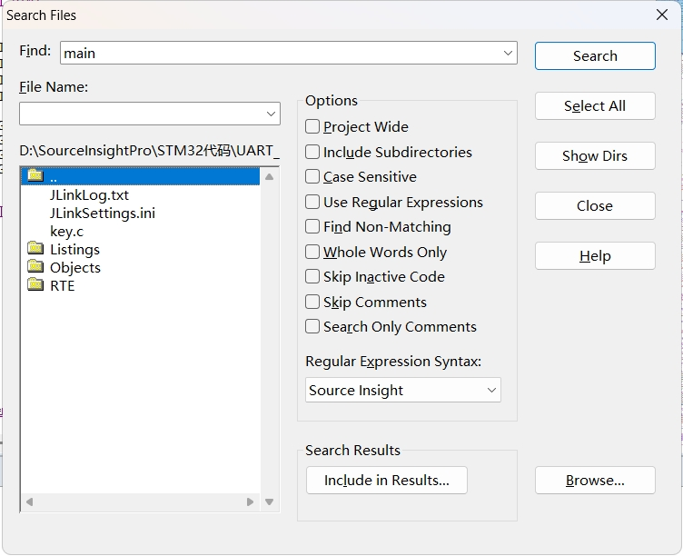
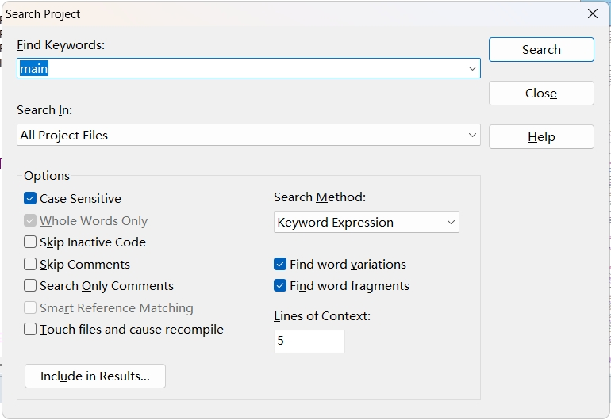

# SourceInsight相关技术点

## 一、基础概念

SourceInsight 是一款功能强大的源代码编辑器和分析工具，主要用于帮助开发人员高效阅读、编写和理解复杂的代码项目，适合处理大型代码库，支持多种编程语言，包括 C、C++、Java、Python 等，核心优势在于其出色的代码导航和分析能力。它通过动态解析源代码生成符号数据库，提供快速跳转、函数调用关系图、上下文引用高亮等功能，使开发者能轻松追踪变量、函数和类的定义与引用。此外，其强大的语法高亮、自动补全和代码片段功能进一步提升了编码效率。

## 二、基本操作

### **工程新建/添加**

1. 点击菜单[Project]>[New Project]；
1. 在弹出的【New Project】对话框中设置【New project name】（项目的名称）；
1. 设置【Where do you want to store the project data file?】 （项目文件保存位置）（也就是想把Source Insight项目放在哪里？）；
1. 点击【Browse】按钮选择源码的目录；
1. 在新弹出的对话框中，点击【Add】或【Add All】（“Add”是手动选择需要添加的文件，而“Add All”是添加所有文件）（同样的“Remove File”，“Remove All”是移除单个文件或者移除所有文件），一般使用“Add All”；
1. 在弹出的提示框中勾上【Recursively add lower sub-directories】(递归添加下级的子目录)并点击【OK】（另外一个【Include top level…】已经是默认被勾上的，不用管）；
1. 勾上【Show only known file types】（已经是默认被勾上的，不用管）；
1. 添加文件完成后点击【Close】，此时界面会返回到主界面；

### **文件新建/添加**

### **符号表同步**

同步文件的意思是让**Source Insight去解析源码，生成数据库**，这样有助于以后阅读源码。比如点击某个函数时就可以飞快地跳到它定义的地方。

1. 先点击菜单【**Project**】>【**Synchronize Files**】；
2. 在弹出的对话框中 勾上【**Force all files to be re-parsed**】（强制解析所有文件）；
3. 点击【**Start**】按钮开始同步；

### **修改编码格式**

* 更改所有文件编码格式

  1. 菜单栏中 **【Options】** > **【Preferences**】 >**File**标签中，最下面的“**Default encod­ing**” 选项；

  2. 选择“**Chinese Simplified（GB2312）CP:936**”（简体中文）这个编码即可改为GB2312；

* 更改单个文件编码

  1. 菜单栏中 **【File】** > **【Reload As Encoding…】** > **【Chinese Simplified（GB2312）CP:936】** > 选择后，点击**load**；

### **视图切换**

切换成普通视图：View - Mono Font View 快捷键`Alt + F12` 

### **常用窗口打开/关闭**

#### **Project Window**窗口

**打开方式：view——>panels——>Project Window**

查看我们的工程所在文件夹以及文件夹下的文件。

#### **Symbol Window**窗口

**打开方式：View——>Symbol Window**

列出当前文件中所有函数、变量、宏，用于快速定位，用于查看我们开启的文件以及文件内所包含的成员函数。

#### **Context Window**窗口

**打开方式：View——>Panels——>Context Window**

自动关联出函数内容或变量定义，用于查看，函数中某个参数与函数的关系。

双击context window可以跳转至函数或变量定义处

自动显示当前光标所在的那个变量、函数或宏的**定义**

#### **Relation Window**窗口

**打开方式：View——>Panels——>Relation Window**

分析和显示代码元素（如函数、变量、宏等）之间的**依赖关系**和**调用关系**，当你选中一个函数、变量、宏或其他符号时，**Relation Window** 会显示该符号在项目中的**所有引用位置**（即哪些地方调用了它或被它调用）。

### **搜索引用**

常用的一种查找方式是选择**Search/Lookup References**，在弹出的Loopup References窗口进行查找操作。在SearchMethod中有四种可选的查找方式：

1. **Simple String（简单字符串匹配）**：可以查找文件中出现的任意字符或字符，甚至可以查找 _upap || u这样的字符串，但是在工程较大时，查找过程会较慢。
2. **Regular Expression（正则表达式匹配）**：使用正则表达式语法进行复杂模式匹配，支持通配符、分组、量词等高级规则，适合于模糊匹配或模式化搜索。
3.  **KeywordExpression（关键字表达式匹配）**：介于 Simple String 和 Regular Expression 之间，支持部分通配符（如 * 和 ?），但不支持完整正则语法。
4. **Look Up Reference（符号引用查找）：**专门用于查找符号（Symbol）的引用关系（如函数调用、变量使用等），而非普通文本。

#### SearchFiles

在**File Name框**中可以填入**文件名或文件夹**。注意当要查询的文件夹双包含子文件夹时，可以勾选Options中的**IncludeSubdirectiories**，实现对各层文件的**递归搜索**。

~~~
Project Wide（全工程搜索）
Include Subdirectories（包含子目录）
Case Sensitive（大小写敏感）
Use Regular Expressions（使用正则表达式）
Find Non-Matching（查找不匹配的内容）
Whole Words Only（全词匹配）
Skip Inactive Code（跳过非活动代码）
Skip Comments（跳过注释）
Search Only Comments（仅搜索注释）
Smart Reference Matching（智能引用匹配）
Touch files and cause recompile（修改文件并触发重新编译）
~~~

#### **SearchProject**

操作与LoopupReferences几乎完全一致，它们各自保存上次搜索的配置。

