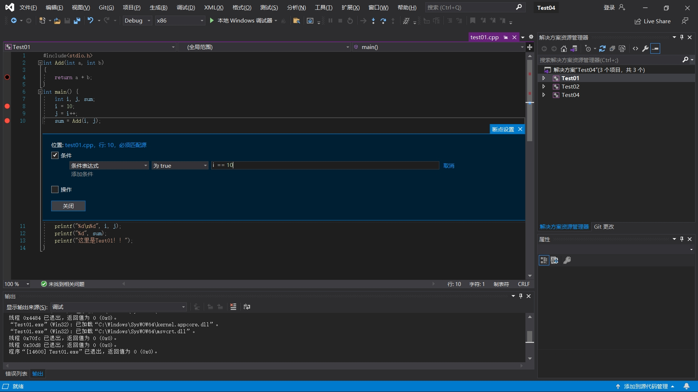

# VisualStudio学习手册

Visual Studio 是一款功能强大的**集成开发环境(IDE)**，适用于各种编程语言和应用类型。

## 基本操作

### 工程创建

#### 工程相关

- 创建/打开项目

- 加载/卸载项目

- 设置启动项
  - 在解决方案管理器中**解决方案**右击选择**属性**——>**通用属性**——>**单启动项目**。
  - 选择**项目点击右键**——>**选择设为启动项。**

#### 解决方案相关

- 添加项目
  - 在解决方案管理器中**解决方案右击选择添加**——>**现有项目**

- 文件相关
  - 创建/打开文件：**项目右击添加**——>**新建项**

  

  - 包括/排除文件：**文件右击**——>**移除或删除**

  

### 工程配置

#### 解决方案配置

#### 平台配置

**指项目构建的目标硬件或操作系统环境。**可以设置在不同的操作系统（如 Windows、Linux）或不同的处理器架构（如 x86、x64、ARM）上构建项目。平台定义了构建目标的属性和设置，以确保代码在特定环境中正确运行。

1. x86：32 位 x86 架构

2. x64：64 位 x86 架构

3. ARM：ARM 架构，常见于移动设备和嵌入式系统

#### 项目类型配置

右击项目——>选择属性——>配置属性：常规。

- **生成文件、生成exe、生成lib、生成dll、实用工具等（dll和lib一般是用于调用的库或插件等）。**
- **调试（Debug）**：用于开发和调试阶段，包含调试符号，便于排查问题。
- **发布（Release）**：用于发布阶段，优化代码以提高性能，去除调试符号。

#### 路径配置

-  输出路径配置
-  头文件路径配置：工程---属性---配置属性---c/c++---常规---附加包含目录：加上头文件存放目录。
-  源文件路径配置
-  库文件路径配置
  - 静态库
    1. 工程---属性---配置属性---链接器---常规---附加库目录：加上lib文件存放目录。
    2. 工程---属性---配置属性---链接器---输入---附加依赖项：加上lib文件名。
  
  
  
  - 动态库
    1. 把引用的dll放到工程的可执行文件所在的目录下。

- 宏定义
- 运行库配置
  1. 在 Visual Studio 中打开要配置的项目。
  2. 选择“属性”菜单，并选择“配置属性”>“C/C++”>“代码生成”。
  3. 在“运行库”下拉菜单中选择你需要使用的运行库，默认值一般为“多线程调试 DLL (/MDd)”。
  4. 
- 调用库配置
  1. 在解决方案管理器下选中**项目名称**，并选择**属性**按钮；随后，在弹出的窗口中依次选择**C/C++**→**常规**→**附加包含目录**→**编辑**，然后将调用库的**include**文件导入进来，同时在**链接器的附加库目录**中导入**lib**文件夹，再在**链接器**→**输入**中选择**附加依赖项**，lib文件的**路径**与其文件名称输入其中。
- 安全检查
  - 识别代码中的安全问题，还能提供修复建议，帮助开发者在开发过程中采取措施预防潜在的安全风险。
  - 

### 工程调试

#### 断点

**程序中调试器将中断的点**。
· 断点创建：移动鼠标选择**行**，然后右侧点击快捷键**F9**。
· 断点删除：右击选择删除即可
· 断点禁用：右击选择禁用即可
· 断点启用：禁用后右击选择启用即可
· 条件断点：右击选择条件——>设置条件

#### 窗口

- 监视窗口：**菜单**——>**调试**——>**窗口**——>**监视**。
  - 
- 内存窗口：**菜单**——>**调试**——>**窗口**——>**内存**。(查找某变量的地址，地址栏填入 &+变量)
  - 
- 线程窗口：**菜单**——>**调试**——>**窗口**——>**线程**。
  - 
- 调用堆栈窗口
  - 

#### 单步调试

- 
  - 全速运行：**从当前断点处恢复程序执行，直到遇到下一个断点或程序结束。**
  - 重新运行：**终止当前调试会话，重新启动程序并从入口点（如 `Main`方法）开始调试。**
  - 逐过程：**执行当前行的代码，但不进入调用的方法内部（方法会被执行，但调试器不会跳入其内部）。**
  - 逐语句：**执行当前行的代码，并进入调用的方法内部（如果有方法调用）。**

